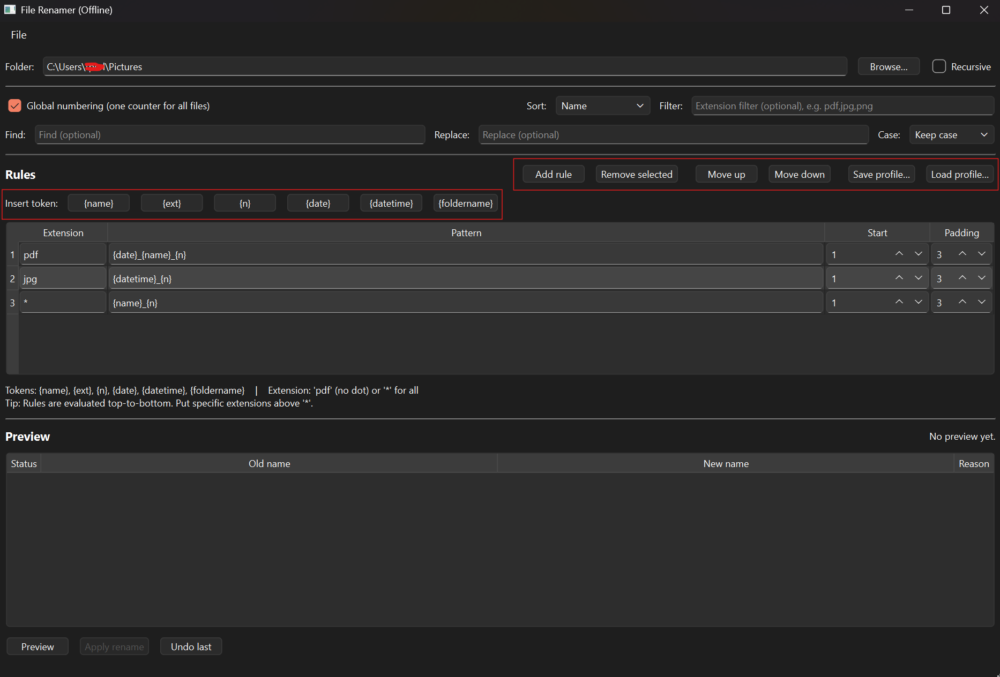
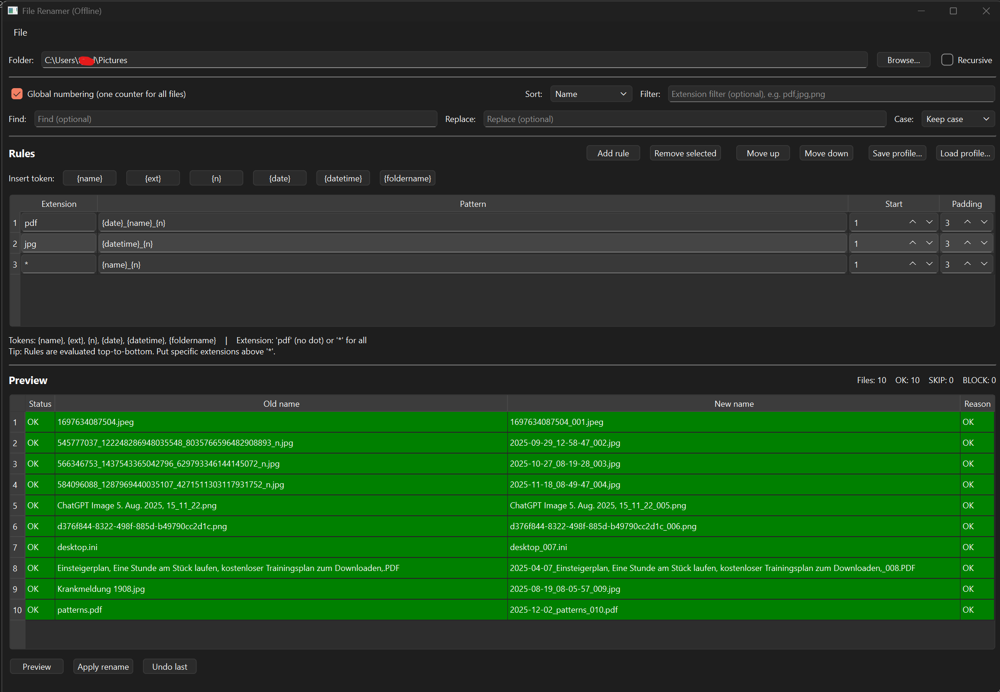
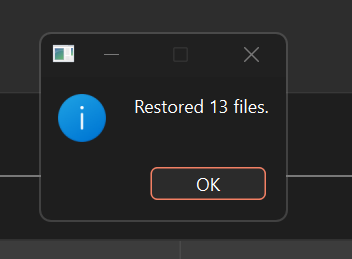

# Offline File Renamer

A small, offline desktop tool to safely rename files using clear, rule-based patterns.

## How to get it?
Download the latest release from Gumroad:
[https://thomasperl.gumroad.com/l/xpzlds]

## Features
- Rule-based renaming by file type
- Live preview before applying changes
- Undo last rename
- Fully offline
- create profiles for different renaming schemes
- Lightweight and easy to use
- Cross-platform (Windows, macOS, Linux)

## Usage
1. Select a folder
2. Define rename rules
3. Click Preview
4. Review the changes
5. Apply rename
6. Undo if needed

## License
This software is licensed for personal and commercial use.

You may:
- Use the software on multiple devices
- Use it for personal or professional work

You may not:
- Redistribute the software
- Sell or sublicense it
- Reverse engineer or modify it for redistribution

## Disclaimer
Always use Preview before Apply.
The author is not responsible for unintended file changes.

## How it works
### 1. Select folder

### 2. Define rules for renaming based on file types.

### 3. Click Preview to see proposed changes.
### 4. Click Apply to rename files as per the defined rules.

### 5. Use Undo to revert the last rename operation if needed.

